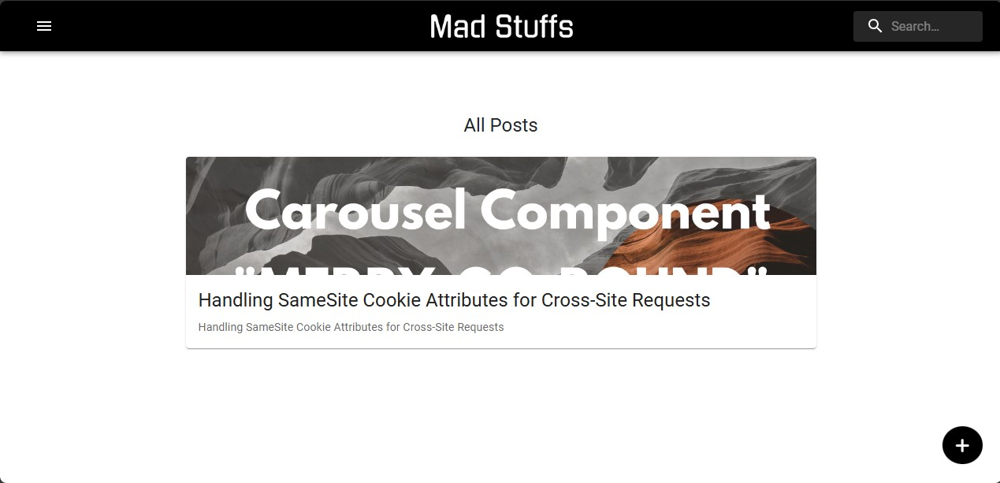
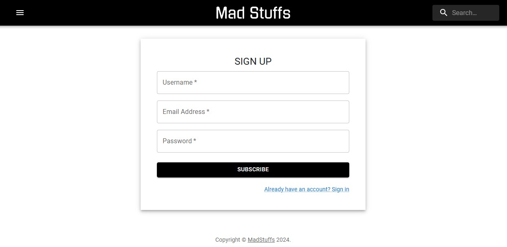
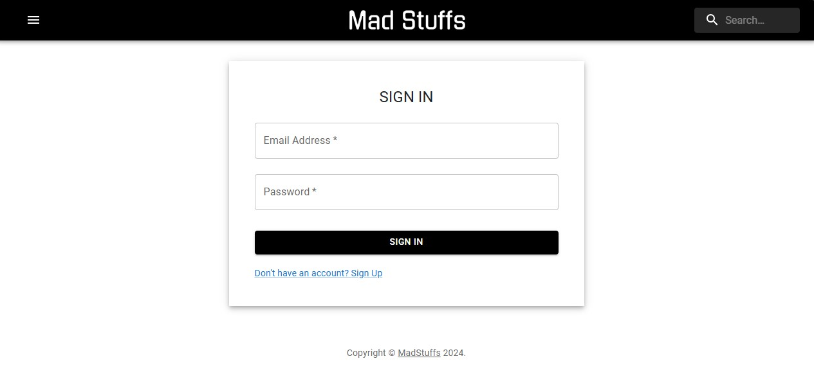
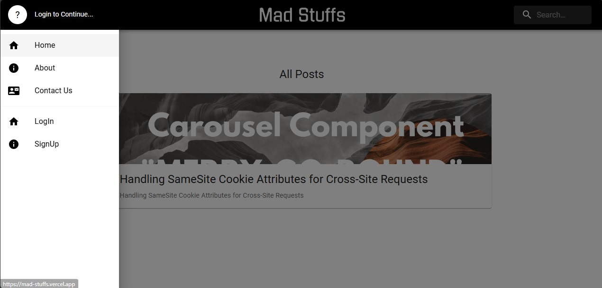
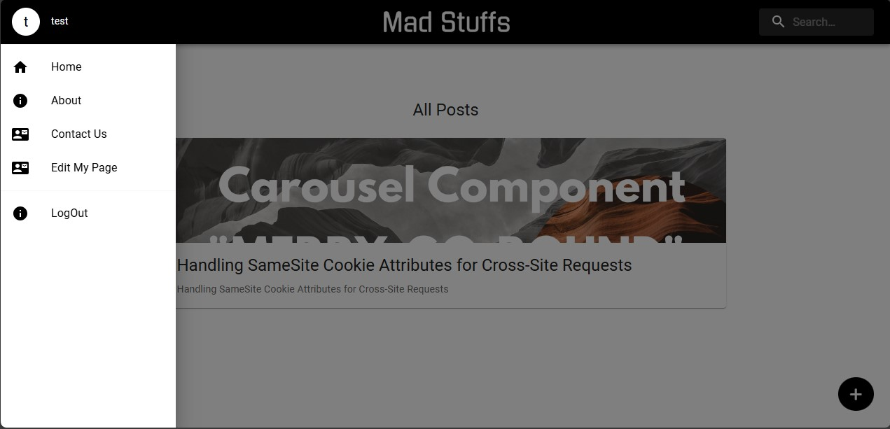
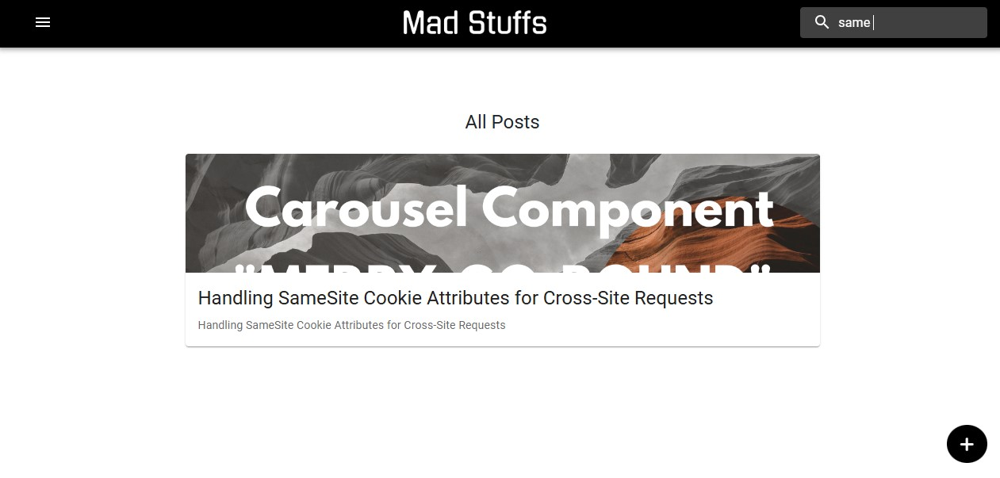
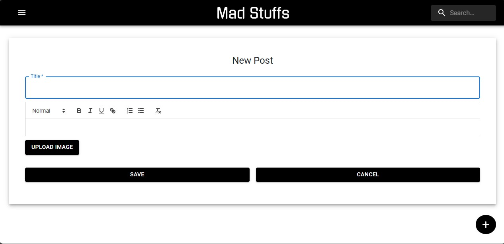
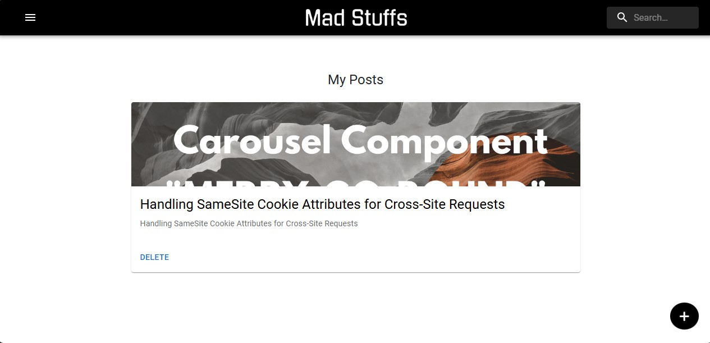
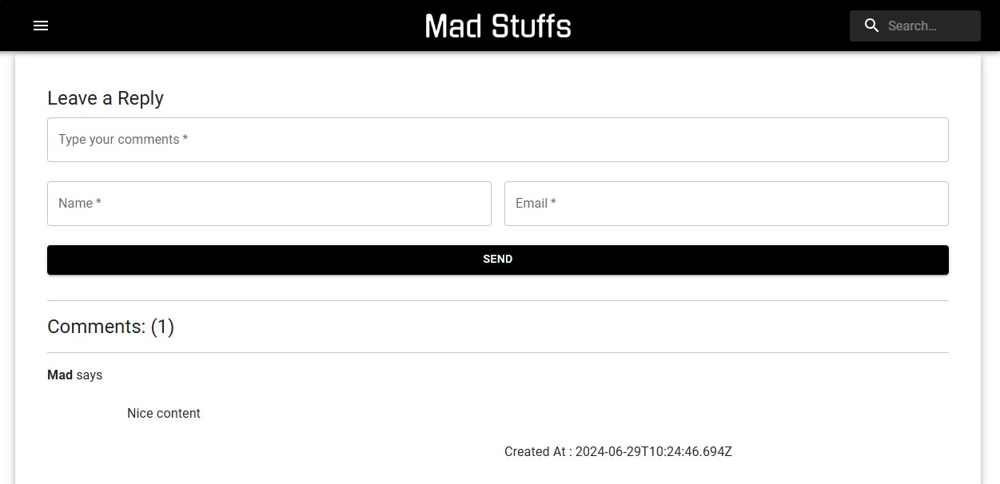

# MadStuffs Blog Application

Welcome to the documentation for MadStuffs Blog application! This is a full-featured blogging platform.This application allows users to create, manage, and share blog posts. It is built with a MERN tech stack, ensuring both performance and scalability.This document will guide you through the setup, configuration, and usage of the blog.

## Features

-User Authentication: Secure registration and login for users.

-Content Management: Easily create, edit, and publish blog posts.

-Search Functionality: Quickly find posts using the search bar.

-Responsive Design: Optimized for viewing on any device, be it a desktop, tablet, or smartphone.

-Comment System: Engage with the content by leaving comments on posts.


## Authors

- [@MadGanGithub](https://github.com/MadGanGithub)


## Deployment

#Frontend:

Frontend of the application has been deployed successfully on Vercel\
https://mad-stuffs.vercel.app/

#Backend:

Backend of the application has been deployed using Docker image

```bash
docker pull dockermad95/madstuffs-server:latest
```


## Screenshots

Front Page:


User Authentication:



Menu:



Search:


Create Page:


Edit Page:


Comments Page:


## Contact

For more information, contact [me](mailto:madhavganesan95@gmail.com).